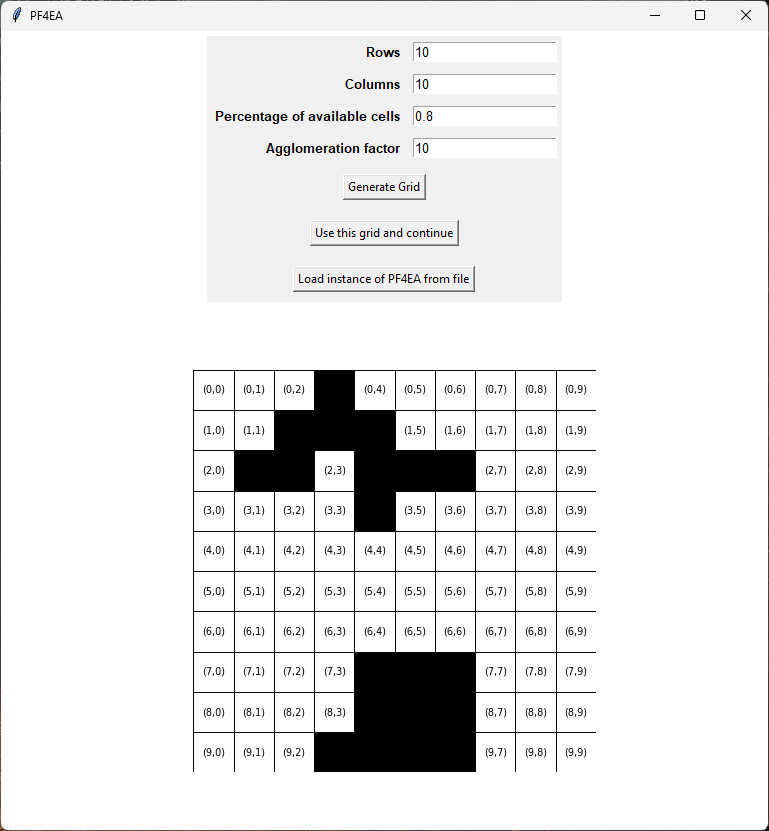
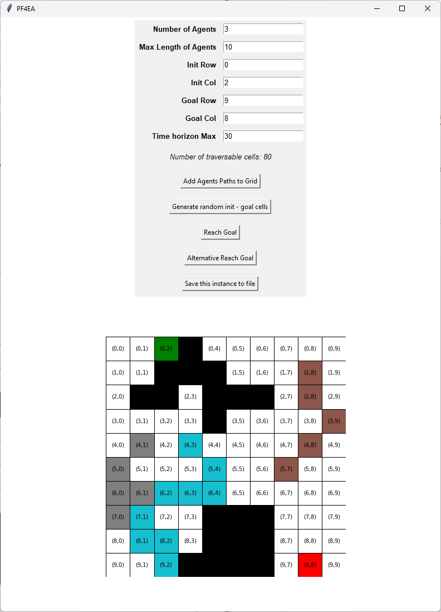
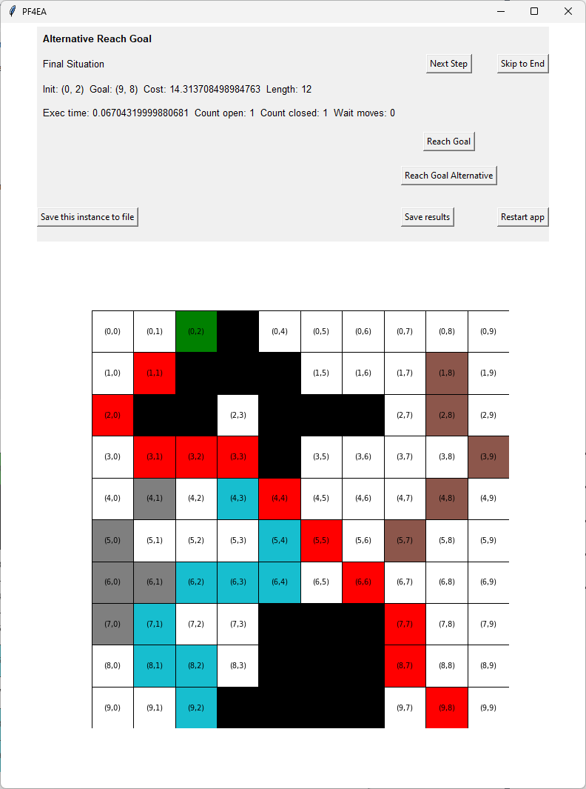

# PF4EA – Pathfinding for an Entry Agent

This project implements a pathfinding solution for a specific agent navigating a grid with static obstacles and other moving agents, using two search strategies.

## 🧠 Project Overview

The goal is to find a conflict-free path for a new entry agent (αₙ₊₁) on a 2D grid that includes:
- Static obstacles
- Predefined paths for existing agents
- Temporal constraints (time horizon)

The application allows users to generate problem instances, apply two versions of a custom `Reach Goal` algorithm, view the step-by-step solutions and compare their performance.


## 🚀 How to Run

```bash
# Ensure all dependencies are installed
pip install -r requirements.txt

# Launch the application
python app.py
```

> For performance testing without GUI overhead:
```bash
python app_without_grid.py
```

## 🧩 Application Structure

### 1. Grid and Obstacle Generation
- Customizable size, traversability %, and obstacle agglomeration factor.
- Uses numpy arrays for grid representation and `networkx` graphs for efficient path computations.




### 2. Agent Setup
- Define number of pre-existing agents and their path lengths.
- Supports random or manual selection of init/goal positions for the entry agent.
- Ensures no collisions among pre-existing agents.




### 3. Pathfinding Algorithms

#### 🔹 Reach Goal (Base)
- Implements A*-like search using:
  - Relaxed path heuristic (via Dijkstra)
  - Open list (sorted insertion)
  - Closed set for visited states

#### 🔸 Reach Goal (Alternative)
- Combines partial path reconstruction with a relaxed path extension.
- Faster on larger or more constrained instances.
- Includes full collision checking logic (same cell, swap, diagonal cross).




## 📦 Core Components

- `Cell`, `Grid`, `Agent`, `Obstacle` – domain classes
- `PF4EA` – problem instance encapsulation
- `Solver` – algorithm logic
- `utility.py` – collision detection helpers

## 💾 File Handling

- Save/load grid and agent configurations as `.txt`
- Save results of algorithm runs (execution time, path length, etc.)
- Instance format includes grid matrix, agent paths, init/goal cells, and time horizon.

## 📄 Example Input File Format

Below is an example of a valid `.txt` instance input for the application:

[[0 0 0 1 0 0 0 0 0 0] <br>
[0 0 1 1 1 0 0 0 0 0] <br>
[0 1 1 0 1 1 1 0 0 0] <br>
[0 0 0 0 1 0 0 0 0 0] <br>
[0 0 0 0 0 0 0 0 0 0] <br>
[0 0 0 0 0 0 0 0 0 0] <br>
[0 0 0 0 0 0 0 0 0 0] <br>
[0 0 0 0 1 1 1 0 0 0] <br>
[0 0 0 0 1 1 1 0 0 0] <br>
[0 0 0 1 1 1 1 0 0 0]] <br>
0 2 <br>
9 8 <br>
30 <br>
3 <br>
[(1, 8)(2, 8)(3, 9)(3, 9)(4, 8)(5, 7)(4, 8)] <br>
[(7, 0)(6, 1)(7, 1)(6, 1)(6, 0)(5, 0)(6, 0)(5, 0)(4, 1)] <br>
[(9, 2)(8, 1)(8, 2)(8, 2)(7, 1)(6, 2)(6, 3)(6, 4)(5, 4)(4, 3)] <br>


Where:
- The matrix defines the grid (1 = obstacle, 0 = traversable).
- The next two lines define the `init` and `goal` coordinates of the entry agent.
- Followed by the `time horizon max`.
- Then the number of pre-existing agents.
- The last lines define the pre-existing agents’ paths.


